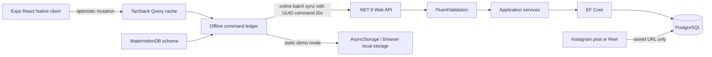

# Powerlifting Program

A local-first powerlifting and athletic coaching platform. The repository contains a .NET 8 API with a PostgreSQL database, an Expo React Native client that exports to the web, and a fully client-side GitHub Pages demo. The product stores a public Instagram post or Reel URL against a training set; it does not upload, proxy, download, or host video.

## Iron Forge Coaching Platform

Iron Forge is dark by default, with charcoal surfaces, chalk text, Iron Crimson actions, zinc highlights, industrial display headings, and monospaced training data. The Expo client uses explicit `COACH` and `ATHLETE` roles. A server-issued JWT is stored only for the authenticated session; client navigation guards keep athletes out of master-program screens, while API guards ensure a coach can access only athletes linked to that coach.

Registration is open for independent coaches and athletes at `/register`. A coach can also generate an athlete invitation from the Dashboard. The API hashes a one-time 256-bit invite token, expires it after 48 hours, sends the branded **Your Coach has invited you to Iron Forge** email through Resend when `Email__Resend__ApiKey` is configured, and forces invite-based registration to create an `ATHLETE` linked to the issuing coach. With no Resend key in local development, email delivery is skipped and the invitation URL is returned only to the authenticated issuing coach; bearer invitation URLs are never written to application logs.

The sign-in screen also offers **Forgot password?**. In `Development` and `LocalPostgres`, the API returns a hashed, single-use, one-hour reset link directly to the screen so local recovery works without an email provider. The presence of that link can reveal whether a local account exists, so `Authentication__ExposePasswordResetLink` must remain disabled on public deployments. Production keeps the enumeration-safe response and sends the link through Resend. Completing a reset revokes previously issued sessions. Set `Client__PasswordResetUrl` to the client callback, such as `https://app.example.com/reset-password`. Fixed GitHub Pages demo accounts do not support password changes.

### Configure Resend Email

The API sends Iron Forge branded invitation and password-reset emails through Resend. Never commit a Resend API key. If a key is pasted into chat, an issue, a log, or source control, revoke it in the Resend dashboard and create a replacement before continuing.

For local development, store the replacement key with .NET user-secrets. Replace `re_xxxxxxxxx` with the real, newly generated API key:

```powershell
dotnet user-secrets set "Email:Resend:ApiKey" "re_xxxxxxxxx" --project src/PowerliftingProgram.Api
dotnet user-secrets set "Email:Resend:From" "Iron Forge <onboarding@resend.dev>" --project src/PowerliftingProgram.Api
dotnet user-secrets set "Client:RegistrationUrl" "http://localhost:8081/register" --project src/PowerliftingProgram.Api
dotnet user-secrets set "Client:PasswordResetUrl" "http://localhost:8081/reset-password" --project src/PowerliftingProgram.Api
dotnet user-secrets set "Authentication:ExposePasswordResetLink" "false" --project src/PowerliftingProgram.Api
```

`onboarding@resend.dev` is only for initial Resend testing and normally sends only to the Resend account owner's email. To email real athletes:

1. In Resend, open **Domains**, choose **Add Domain**, and enter a domain you own, such as `mail.ironforge.app`.
2. At the DNS host for that domain, add every record Resend displays. Copy the record type, host/name, and value exactly. These normally include DKIM TXT records and an SPF TXT record for the return-path subdomain.
3. Add a DMARC TXT record at `_dmarc.ironforge.app`. Start with `v=DMARC1; p=none; rua=mailto:dmarc@ironforge.app`, review reports, then move to `p=quarantine` or `p=reject` when legitimate mail is aligned.
4. Wait for DNS propagation, then choose **Verify DNS Records** in Resend. Do not add a second SPF TXT record at the same hostname; merge authorized senders into one SPF policy when necessary.
5. Change the sender to a verified address, such as `Iron Forge <notifications@ironforge.app>`, in user-secrets locally and in the production API host's secret/configuration store.
6. Set the production callback URLs to the public HTTPS client routes, for example `https://app.ironforge.app/register` and `https://app.ironforge.app/reset-password`.

The API key belongs only on the API server. It must never use an `EXPO_PUBLIC_` variable or be bundled into the Expo client.

The coach-only **Programs** route manages reusable master templates: `Template -> Weeks -> Days -> Exercises -> Sets x Reps @ RPE / %1RM / exact load`. Assigning a template clones it into a dated, active live training log for exactly one linked athlete. The master template is unchanged afterward; coaches can update a live training day through the API without mutating the source template. In Training Log, athletes record completed loads, reps, and statuses, and coaches can review and adjust the assigned work.

## System Overview and Architecture



The solution uses Clean Architecture boundaries:

- `PowerliftingProgram.Domain` contains framework-free entities and enumerations.
- `PowerliftingProgram.Application` owns commands, strict FluentValidation rules, fatigue/readiness modeling, programming calculations, session analytics, and reward rules.
- `PowerliftingProgram.Infrastructure` implements EF Core persistence, idempotent command processing, and Instagram URL policy.
- `PowerliftingProgram.Api` exposes HTTP endpoints and selects either a temporary in-memory store or PostgreSQL at startup.
- `client` is the Expo Router application used for Android, iOS, and React Native Web.

The relational hierarchy is `AthleteProfile -> TrainingBlock -> TrainingWeek -> TrainingDay -> PrescribedExercise -> TrainingSet`. Contextual coach conversations can target a day, exercise, or individual set. `SyncCommand.CommandId` is unique in PostgreSQL, so retrying an offline command returns the original outcome instead of applying the mutation twice.

### Training Load and Readiness

For each completed set, the application computes stress as:

$$
Stress = Reps \times \left(\frac{\%1RM}{70}\right)^2 \times (Effort\%)^5 \times ExerciseTypeModifier
$$

The `%1RM` term uses percentage points, for example `75` for $75\%$.

Acute load uses a 7-day exponential decay and chronic load uses a 28-day decay. For either load $L$, daily stress $S$, and decay duration $D$:

$$
L_t = e^{-1/D}L_{t-1} + (1 - e^{-1/D})S_t
$$

The readiness score compares acute load to chronic load, then clamps the fatigue penalty to output an integer from 0 to 100. Rest days are processed as $S_t = 0$, so both loads decay naturally even when no workout is logged.

### Offline and Video Behavior

The client writes a set status or Instagram URL to local storage before network I/O, updates TanStack Query immediately, then appends a UUID-backed command to `sync_commands`. A connectivity listener flushes the commands to `POST /api/sync` when a network is available. The server persists processed command IDs to make the flush idempotent.

Instagram URLs must be HTTPS links hosted on `instagram.com` or a subdomain and begin with `/p/` or `/reel/`. Use only public links that athletes and coaches are permitted to share. The application does not authenticate to Instagram and does not guarantee availability of third-party content.

## Repository Layout

```text
.
├── PowerliftingProgram.sln
├── docker-compose.yml
├── database/scripts/
│   ├── Initialize-LocalPostgres.ps1
│   └── seed-test-data.sql
├── src/
│   ├── PowerliftingProgram.Api/
│   ├── PowerliftingProgram.Application/
│   ├── PowerliftingProgram.Domain/
│   └── PowerliftingProgram.Infrastructure/
├── tests/PowerliftingProgram.Application.Tests/
├── client/
│   ├── app/
│   ├── src/data/watermelonSchema.ts
│   ├── src/data/localStore.ts
│   └── src/hooks/useSyncWorkout.ts
└── .github/workflows/deploy-pages.yml
```

## Local Installation

### Prerequisites

Install the following before starting:

- .NET 8 SDK
- Docker Desktop with Docker Compose v2 for durable PostgreSQL mode
- Node.js 20 LTS and npm
- Android Studio or Xcode only when running a native simulator

### Temporary In-Memory Database

`Development` uses EF Core's InMemory provider. It creates a transient database named `powerlifting-program-development` and loads a deterministic athlete, active block, Week 4 / Day 1 workout, completed/pending sets, coach feedback, an Instagram link, a sync command, and an achievement. The data exists only while the API process is running.

1. Restore packages with `dotnet restore PowerliftingProgram.sln`.
2. Run the API with `dotnet run --project src/PowerliftingProgram.Api --launch-profile "PowerliftingProgram.Api (Temporary In-Memory)"`.
3. Open `http://localhost:5080/scalar/v1` and exercise the API against the seeded mock data.

This mode is intentionally temporary: registrations and training data disappear whenever the API process stops. The standard `PowerliftingProgram.Api` launch profile uses persistent PostgreSQL instead.

Local sample accounts are `coach@ironforge.local` / `LocalDemoCoach!2026` and `athlete@ironforge.local` / `LocalDemoAthlete!2026`. Sample seeding is blocked outside the `Development` and `LocalPostgres` environments.

### Create the Persistent PostgreSQL Database

The durable PostgreSQL schema is defined by the migrations in `PowerliftingProgram.Infrastructure/Persistence/Migrations`, including the coaching platform and password-reset account fields. `database/scripts/seed-test-data.sql` is an optional idempotent fixture matching the mock dataset.

1. Install Docker Desktop and the EF CLI once: `dotnet tool install --global dotnet-ef`.
   On Windows with WinGet, install Docker Desktop with `winget install -e --id Docker.DockerDesktop`, launch Docker Desktop, complete its setup, and reopen PowerShell so `docker --version` succeeds.
2. From the repository root, run:

   ```powershell
   .\database\scripts\Initialize-LocalPostgres.ps1
   ```

3. The script starts the PostgreSQL container and applies every EF migration without adding sample users. The database is `powerlifting_program` at `localhost:5432`, with the `powerlifting` user and password configured in `docker-compose.yml`.
4. To load the optional fixture accounts and training records, run `./database/scripts/Initialize-LocalPostgres.ps1 -SeedSampleData`.
5. Start the API with the standard persistent profile:

   ```powershell
   dotnet run --project src/PowerliftingProgram.Api
   ```

### Reset PostgreSQL for Workflow Testing

To delete all local accounts, invitations, coaching assignments, programs, training logs, and events, stop the API and run:

```powershell
.\database\scripts\Reset-LocalPostgres.ps1
```

The script asks for confirmation, recreates only the local `powerlifting_program` database, and applies every EF migration. The empty database is then ready to test this flow from the beginning:

1. Register a coach account.
2. Switch the coach to **My Training** and verify its independent lifter profile.
3. Invite a new lifter and accept the registration link.
4. Invite an existing account and sign in through its invitation link.
5. Add concurrent specialist or temporary coaching assignments.
6. Revoke or transfer a primary coach and verify coaching history and access.

For an automated reset without the confirmation prompt, use `-Force`:

```powershell
.\database\scripts\Reset-LocalPostgres.ps1 -Force
```

To reset and then load the deterministic sample fixture, use:

```powershell
.\database\scripts\Reset-LocalPostgres.ps1 -Force -SeedSampleData
```

This script is intentionally limited to the Docker Compose local database. Do not adapt it to a shared or production connection string.

### Open the Local PostgreSQL Database

The PostgreSQL database is available only when the Docker container is running. Check its status from the repository root:

```powershell
docker compose ps
```

Open an interactive database prompt with:

```powershell
docker compose exec postgres psql -U powerlifting -d powerlifting_program
```

Useful `psql` commands:

```sql
\dt
SELECT "Email", "DisplayName", "Role", "CoachId" FROM "PlatformUsers";
SELECT "DisplayName", "CompetitionWeightClass" FROM "AthleteProfiles";
\q
```

You can also connect using pgAdmin, DBeaver, or a PostgreSQL extension with these values:

```text
Host: localhost
Port: 5432
Database: powerlifting_program
Username: powerlifting
Password: powerlifting
```

The `Development` environment uses an EF Core in-memory database instead. It cannot be opened with a database client and is cleared when the API process stops.

### Run the .NET API

1. Run `dotnet test PowerliftingProgram.sln` after restoring packages.
2. Use the standard launch profile for durable PostgreSQL. Select `PowerliftingProgram.Api (Temporary In-Memory)` only when data loss after shutdown is acceptable.
3. To add a schema change, modify the entity/configuration, then create and apply a migration:

   ```powershell
   $env:ASPNETCORE_ENVIRONMENT = "LocalPostgres"
   dotnet ef migrations add MeaningfulMigrationName --project src/PowerliftingProgram.Infrastructure --startup-project src/PowerliftingProgram.Api
   dotnet ef database update --project src/PowerliftingProgram.Infrastructure --startup-project src/PowerliftingProgram.Api
   ```

4. Scalar API reference is available at `http://localhost:5080/scalar/v1` in Development and LocalPostgres.

When Docker is unavailable, use the Temporary In-Memory Database section. It provides the same EF entity model and seed fixture for API development but does not persist data after the API stops.

For a containerized API build, run this from the repository root:

```powershell
docker build -f src/PowerliftingProgram.Api/Dockerfile -t powerlifting-program-api .
docker run --rm -p 8080:8080 --env-file .env powerlifting-program-api
```

### Run the Expo Client

1. Open a second terminal and change to `client`.
2. Install dependencies with `npm install`.
3. Create `client/.env` with the following values for a live local API:

   ```text
   EXPO_PUBLIC_API_URL=http://localhost:5080
   EXPO_PUBLIC_STATIC_DEMO=false
   ```

4. Start the Expo development server with `npm run web -- --clear`, or use `npm run start` then press `w` for the web client, `a` for Android, or `i` for iOS. Use the URL shown by Expo, commonly `http://localhost:8081`.
5. Run `npm run typecheck`, `npm run lint`, and `npm run export:web` before opening a pull request. The GitHub quality workflow runs the same client checks together with the .NET build and tests.

The first client visit opens a development-only proxy login. Choose `Alex Morgan` for the lifter dashboard or `Coach Taylor` for the coach dashboard. The role is saved locally, Dashboard is the first signed-in screen, and Log out clears the proxy session. Coaches can select an active athlete from the sidebar; lifters are limited to their own data. The coach-only **Programs** route presents `Program -> Weeks -> Training days -> Exercise prescriptions`: coaches create, edit, activate, and delete programs; add or remove weeks and days; add Squat, Bench, Deadlift, or accessory prescriptions; and prescribe each exercise by RPE, RIR, or an exact kg/lb load. Created programs and every later plan change are immediately available in the selected athlete's **Training Log**. Coaches can also add a dated workout day or a complete accessory prescription directly while reviewing that log. The **Program Schedule** route gives every training day a planned date: coaches set or revise dates, while lifters may move one workout or reflow every workout in a disrupted week from a new start date. The last scheduling change records whether the coach or lifter made it. The shared **Training Log** is the athlete's complete program view: either role can select a program and navigate every scheduled day using the day list or previous/next controls. Athletes enter the actual weight lifted before completing every RPE or RIR set, attach a public Instagram post or Reel to any set, and give the session a $1$–$10$ effort rating for future stress management. Both identities leave local comments directly under the selected training log. **Analytics** reads those program-day logs to render weekly completed tonnage, done/skipped/remaining set adherence, heaviest squat/bench/deadlift sets, session-rating trend, and a fatigue/readiness planning estimate. There is no standalone chat workflow. Profile edits, program edits, schedules, comments, logs, and notification choices are stored locally for development.

The client has a WatermelonDB schema at `client/src/data/watermelonSchema.ts` for the native local database hierarchy. The included static demo adapter uses AsyncStorage, which maps to browser local storage on the web. This makes the app deployable to GitHub Pages while maintaining the same snapshot and command-ledger contract used by the production synchronization path.

### Auth, Invite, and Programming Endpoints

- `POST /api/auth/register`: registers an independent `COACH` or `ATHLETE`, or accepts a valid athlete invitation.
- `POST /api/auth/login`: returns a JWT-backed account session.
- `POST /api/auth/password-reset/request`: returns a one-hour reset link in explicit local mode, or sends the enumeration-safe production email when the account exists.
- `POST /api/auth/password-reset/complete`: consumes a reset token, replaces the password, and revokes existing sessions.
- `GET /api/auth/me`: returns the authenticated account.
- `GET /api/auth/invitations/{token}`: validates an unexpired invitation for registration.
- `POST /api/coach/athlete-invitations`: coach-only creation and branded email delivery of a 48-hour athlete invite.
- `GET /api/coach/athletes`: coach-only roster limited to athletes linked to the requesting coach.
- `GET|POST|PUT|DELETE /api/program-templates`: coach-owned master-template operations.
- `POST /api/program-templates/{templateId}/assignments`: clones a template into one athlete's live training log.
- `GET /api/live-training/current`: returns the authenticated athlete's active assigned log.
- `GET /api/live-training/athletes/{athleteProfileId}`: coach-only active-log review for a linked athlete.
- `PUT /api/live-training/days/{trainingDayId}`: coach-only live-day modification; never edits a master template.

### Existing Training Endpoints

- `POST /api/sync`: accepts 1 to 100 pending ledger commands and returns each processed/rejected outcome.
- `POST /api/sync/logged-set`: validates and applies one completed or skipped set.
- `POST /api/instagram/validate-video-url`: validates an Instagram post/Reel URL without storing media.
- `POST /api/training/working-sets`: calculates RPE-adjusted working-set targets from e1RM.
- `POST /api/training/warm-ups`: calculates progressive barbell warm-ups and per-side plate loading.
- `GET /api/training/athletes/{athleteId}/readiness`: returns 7-day/28-day EWMA readiness.
- `GET /api/training/days/{trainingDayId}/analytics?athleteOneRepMaxKg=...`: returns planned versus completed tonnage and stress.

## Free GitHub Pages Deployment

GitHub Pages hosts the web client for free when the repository is public. It cannot run ASP.NET Core, PostgreSQL, EF Core migrations, or the secure server-side sync API. This repository therefore deploys as a fully interactive, browser-local demo unless you later connect it to an API hosted elsewhere.

### Publish the Demo

1. Sign in at [GitHub](https://github.com/) and create a new **public** repository. Use a simple name such as `PowerliftingLogs`, and do not add a README, `.gitignore`, or license because this folder already has them.
2. Open PowerShell in the repository root and check whether a Git remote is already configured:

   ```powershell
   git remote -v
   ```

3. If no remote is listed, connect the local repository to the new GitHub repository. Replace `<your-github-username>` with your GitHub username:

   ```powershell
   git branch -M main
   git remote add origin https://github.com/<your-github-username>/PowerliftingLogs.git
   ```

4. Commit and publish the project:

   ```powershell
   git add .
   git commit -m "Deploy Iron Forge to GitHub Pages"
   git push -u origin main
   ```

5. On the GitHub repository page, open **Settings** > **Pages**. Under **Build and deployment**, set **Source** to **GitHub Actions**.
6. Open the **Actions** tab. The **Deploy static demo to GitHub Pages** workflow runs automatically whenever `main` is pushed. If it ran before Pages was enabled, open the workflow and choose **Run workflow**.
7. When the run has a green check mark, open **Settings** > **Pages** and select the published URL. The address is `https://<your-github-username>.github.io/PowerliftingLogs/` when the repository has that name.

The demo offers Coach and Athlete sign-in buttons without a server. Its programs, logs, and settings are stored only in each visitor's browser local storage. Clearing browser storage or opening the site in another browser starts a separate demo copy.

### Connect a Live API Later

The Pages workflow automatically chooses its mode at build time:

- With no `EXPO_PUBLIC_API_URL` variable, it publishes the free browser-local demo.
- With `EXPO_PUBLIC_API_URL` set, it publishes the web client configured to call that public HTTPS API.

To use a live API, deploy the .NET API and PostgreSQL to separate hosting first. In GitHub, open **Settings** > **Secrets and variables** > **Actions** > **Variables**, create `EXPO_PUBLIC_API_URL`, and enter the API's public URL, for example `https://api.example.com`. Push to `main` or rerun the workflow after saving it.

`EXPO_PUBLIC_API_URL` is public client configuration, not a secret. Keep database connection strings, JWT signing keys, and email API keys only in the API host's secret storage.

## Production Notes

- Keep `Authentication__Jwt__SigningKey` in secret storage, use a random value of at least 64 bytes for HS512, and rotate it on a regular production schedule.
- Keep `ConnectionStrings__TrainingDatabase` in secret storage. The committed PostgreSQL credentials are scoped to the explicit `LocalPostgres` environment only.
- Keep `Authentication__ExposePasswordResetLink=false` in every public environment; direct reset links are intended only for local development.
- Set `Email__Resend__ApiKey` and a verified `Email__Resend__From` address before sending production invitations.
- Set `Client__RegistrationUrl` and `Client__PasswordResetUrl` to the deployed client routes before sending invitations or password-reset email.
- Terminate TLS before the API and allow only trusted CORS origins.
- Use database backups, health checks, and managed secret injection for the production PostgreSQL connection string.
- Keep the unique `SyncCommands.CommandId` index intact. It is the server-side replay guard for offline mutations.
- Instagram content availability and access are controlled by Instagram and the account owner. Store links only with consent and honor applicable privacy, athlete-data, and platform policies.
