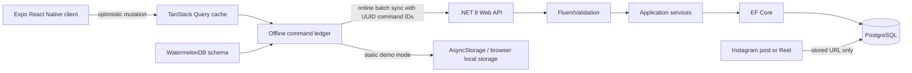

# Architecture and System Overview

## Platform Summary

The solution uses Clean Architecture boundaries:

- `PowerliftingProgram.Domain` contains framework-free entities and enumerations.
- `PowerliftingProgram.Application` owns commands, validation rules, fatigue/readiness modeling, programming calculations, session analytics, and reward rules.
- `PowerliftingProgram.Infrastructure` implements EF Core persistence, idempotent command processing, and Instagram URL policy.
- `PowerliftingProgram.Api` exposes HTTP endpoints and selects either temporary in-memory storage or PostgreSQL.
- `client` is the Expo Router application for Android, iOS, and web.

The relational hierarchy is:

`AthleteProfile -> TrainingBlock -> TrainingWeek -> TrainingDay -> PrescribedExercise -> TrainingSet`

## System Flow



## Training Load and Readiness

For each completed set, the application computes stress as:

$$
Stress = Reps \times \left(\frac{\%1RM}{70}\right)^2 \times (Effort\%)^5 \times ExerciseTypeModifier
$$

The `%1RM` term uses percentage points, for example `75` for 75%.

Acute load uses a 7-day exponential decay and chronic load uses a 28-day decay:

$$
L_t = e^{-1/D}L_{t-1} + (1 - e^{-1/D})S_t
$$

The readiness score compares acute load to chronic load and outputs an integer from 0 to 100.

## Offline and Instagram URL Behavior

- The client writes set status or Instagram URL locally before network I/O.
- TanStack Query is updated immediately.
- A UUID-backed command is appended to `sync_commands`.
- Connectivity events flush commands to `POST /api/sync`.
- The server persists processed command IDs to keep replay idempotent.

Instagram URLs must:
- Use HTTPS
- Be on `instagram.com` (or subdomain)
- Start with `/p/` or `/reel/`

The app stores only URLs and does not upload or host video content.

## Repository Layout

```text
.
├── PowerliftingProgram.sln
├── docker-compose.yml
├── database/scripts/
│   ├── Initialize-LocalPostgres.ps1
│   └── seed-test-data.sql
├── src/
│   ├── PowerliftingProgram.Api/
│   ├── PowerliftingProgram.Application/
│   ├── PowerliftingProgram.Domain/
│   └── PowerliftingProgram.Infrastructure/
├── tests/PowerliftingProgram.Application.Tests/
├── client/
│   ├── app/
│   ├── src/data/watermelonSchema.ts
│   ├── src/data/localStore.ts
│   └── src/hooks/useSyncWorkout.ts
└── .github/workflows/deploy-pages.yml
```
